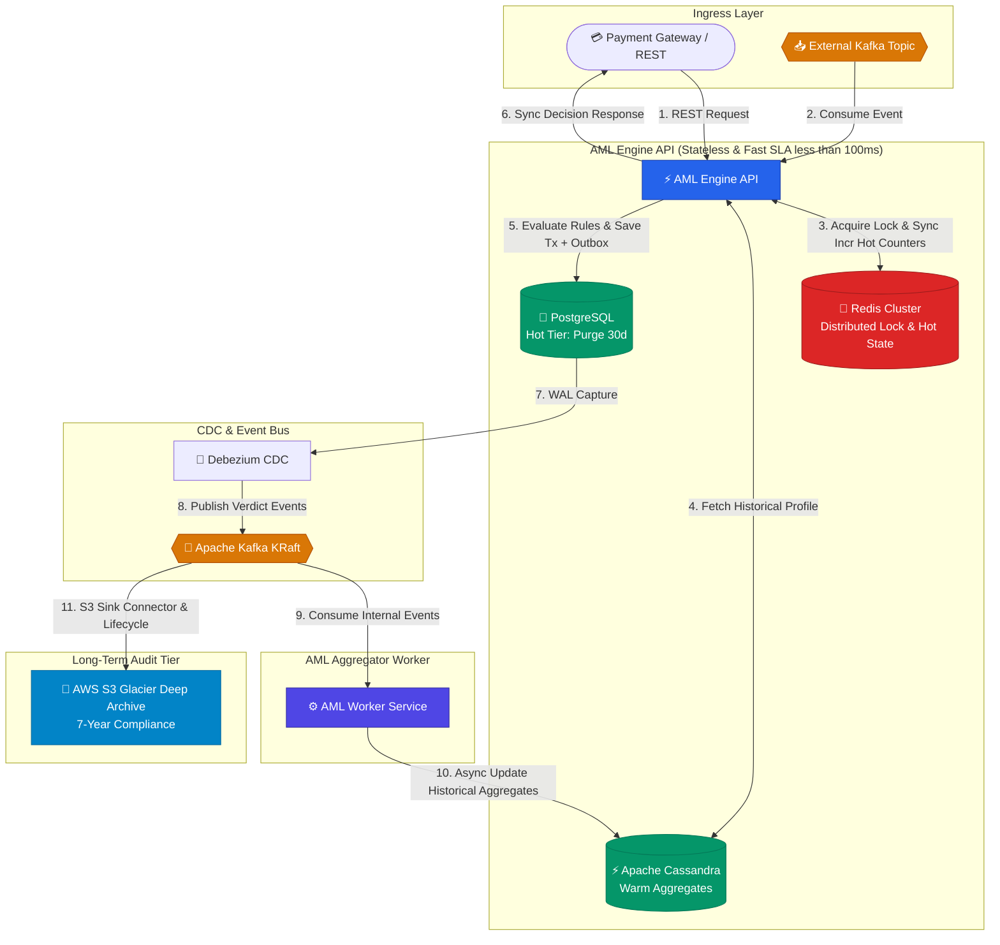

# AML Service — High-Throughput Fraud & AML Detection Engine

[](https://github.com/anakidkin/aml-service/actions/workflows/ci.yml)
[](https://github.com/anakidkin/aml-service/pkgs/container/aml-service)
[](https://openjdk.org/)
[](https://spring.io/projects/spring-boot)

Real-time Anti-Money Laundering (AML) & Fraud Detection engine designed for high-throughput banking systems. The service
evaluates financial transactions against customizable compliance and risk rules within strict SLA targets.

---

## Key Architectural Requirements & SLA

* **Target Throughput:** 10,000 Transactions Per Second (TPS).
* **Latency SLA:** `< 100 ms` End-to-End decision pipeline (Targeting ~40–60 ms p99).
* **Audit & Regulatory Compliance:** Guaranteed immutable audit trail and historical aggregation (Transactional Outbox +
  Apache Cassandra).
* **Availability & Resilience:** Zero data-loss architecture (**At-Least-Once** event delivery via Outbox Pattern &
  Kafka).
* Long-Term Audit Retention (Compliance): 7-year immutable historical audit storage.

---



### Data Retention & Storage Tiers

To support 10k TPS while keeping operational storage lightweight and meeting strict SLA targets:

* **PostgreSQL (Hot Data):** Retains primary transactions & outbox logs for **30 days** before automated purging.
* **Apache Cassandra (Warm Metrics):** Stores 24h / 30d rolling aggregates using native **TTL (30-90 days)** for instant
  SLA-compliant risk evaluation.
* **AWS S3 & Glacier (Cold Storage / Audit):** Kafka streams immutable events to **S3**, automatically transitioning to
  **Glacier Deep Archive** after 30 days for cost-effective **7-year regulatory compliance**.

## Latency Budget Breakdown (< 100 ms)

| Step                    | Operation                              | Target Latency     | Tech Stack                     |
|-------------------------|----------------------------------------|--------------------|--------------------------------|
| **1. Ingestion**        | REST Request ingestion & mapping       | ~5–10 ms           | Spring Web / MapStruct         |
| **2. Context Fetch**    | Aggregation metrics lookup (24h / 30d) | ~10–15 ms          | Apache Cassandra               |
| **3. Rule Evaluation**  | In-memory rules execution pipeline     | ~5–10 ms           | Pure Java Domain Rules         |
| **4. Persistence**      | Transaction + Outbox Event atomic save | ~10–15 ms          | PostgreSQL (Transactional)     |
| **5. Asynchronous Pub** | Outbox polling & Kafka verdict publish | Async (Background) | Kafka Producer / Outbox Poller |
| **Total**               | **End-to-End Synchronous Decision**    | **~30–50 ms**      | **(Well under 100ms SLA)**     |

---

## Tech Stack & Infrastructure

* **Java 25** + **Spring Boot 4**
* **PostgreSQL** (Transaction storage & Transactional Outbox)
* **Apache Cassandra** (NoSQL high-speed transaction history & aggregated account metrics)
* **Apache Kafka (KRaft mode)** (High-throughput message streaming without ZooKeeper)
* **AWS S3 / S3 Glacier** (Cost-effective 7-year audit retention pipeline via lifecycle policies)
* **Debezium** (CDC outbox event streaming)
* **Redis / Valkey** (High-speed caching layer)
* **Testcontainers & AssertJ** (Integration testing with real dependencies)

---

## Quick Start (Local Setup)

### Prerequisites

* Docker Engine 24+ & `docker compose` CLI plugin
* Java 25+ JDK
* Gradle 8.x (or Gradle Wrapper included)
* `pre-commit` CLI (recommended for local contributors)

### 1. Code Quality & Pre-commit Hooks Setup

The project enforces formatting (Spotless), secret scanning (Gitleaks), and syntax validation via Git pre-commit hooks.

1. **Install `pre-commit` CLI on your system (one-time setup):**
    * **macOS:** `brew install pre-commit gitleaks`
    * **Linux:** `sudo apt install pre-commit` (or `pip install pre-commit`)
    * **Windows:** `winget install pre-commit.pre-commit` (or `pip install pre-commit`)

2. **Initialize hooks:**
   Compiling the project via `./gradlew compileJava` will automatically bind the pre-commit hooks if the CLI is present
   on your system.

* **Run all quality checks manually:**
  ```bash
  pre-commit run --all-files

```

* **Emergency bypass (if needed):**
```bash
git commit -m "hotfix: urgent change" --no-verify

```

### 2. Start Infrastructure Dependencies

```bash
docker compose up -d
```

*This spins up PostgreSQL, Apache Cassandra, Apache Kafka (KRaft), Debezium, and Valkey.*

### 3. Build and Run Application

```bash
./gradlew bootRun

```

### 4. Run Test Suite

```bash
./gradlew test
./gradlew integrationTest
./gradlew jmh
./gradlew gatlingRun
```

### 5. Send Test Transaction for Evaluation

```bash
curl -X POST http://localhost:8080/api/v1/transactions \
  -H "Content-Type: application/json" \
  -d '{
    "accountFrom": "ACC-100200",
    "accountTo": "ACC-900800",
    "amount": 15000.00,
    "currency": "USD",
    "mccCode": "5411",
    "isP2p": false
  }'
```

## Roadmap

Check [ROADMAP.md](./ROADMAP.md) for planned performance optimizations, memory profiling tasks, and infrastructure
enhancements.